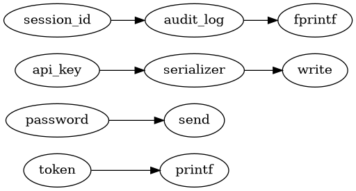

# LeakLens: Privacy Leak Detection for Taint-Style KLEE Outputs

[](https://github.com/shivanipoosarla/leaklens-privacy-leak-detector/actions/workflows/tests.yml)


LeakLens is a small Python post-processor that summarizes potential privacy leaks from taint-style KLEE/KLEE-taint logs. It flags cases where tainted symbolic inputs appear to reach configured output sinks such as `printf()`, `fprintf()`, `send()`, `write()`, or `log_data()`.

This repository is intentionally structured as a runnable prototype. The bundled sample logs let the analyzer run without installing KLEE first. Full `.ktest` parsing and direct raw-KLEE-output correlation are listed as future work rather than claimed as complete features.

## Why this project exists

KLEE is useful for symbolic execution and path exploration, but privacy leak detection often requires additional analysis. LeakLens explores a lightweight post-processing layer that can summarize taint-style evidence after symbolic execution and produce readable reports for developers or security reviewers.

## What LeakLens does

- Parses taint-style log files that describe symbolic input flows.
- Supports multiple evidence formats, including `source=... path=...`, `sink=...`, `reached sink ...`, and arrow flows such as `secret -> log_data -> fprintf`.
- Detects tainted flows reaching configurable sink functions.
- Extracts source, sink, path, line number, evidence, parser rule, and severity.
- Generates Markdown, JSON, and Graphviz DOT reports.
- Includes synthetic sample logs for direct, network-style, logging, benign, and mixed-format cases.
- Includes C examples that model console, logging, network-style, and benign symbolic-input scenarios.
- Includes parser tests and C syntax checks.

## What LeakLens does not do yet

LeakLens currently analyzes taint-style output logs. It does **not** yet perform runtime taint tracking, does **not** instrument KLEE, does **not** parse `.ktest` files, and does **not** prove that all leaks are detected. It is a post-processing prototype.

## Architecture

```text
C Example Program
   |
LLVM Bitcode
   |
KLEE / KLEE-taint Execution
   |
Taint-style log output
   |
LeakLens Python Parser
   |
Source/Sink Extraction + Flow Summary
   |
Markdown / JSON / DOT Reports
```

More detail: [`docs/ARCHITECTURE.md`](docs/ARCHITECTURE.md)

## Repository structure

```text
src/
  leaklens.py
examples/
  leak_printf.c
  leak_log.c
  leak_network.c
  benign.c
sample-output/
  direct_leak.info
  network_leak.info
  log_leak.info
  benign.info
  realistic_formats.info
stubs/
  klee/klee.h        # local syntax-check stub only
reports/
  generated Markdown/JSON/DOT reports
docs/
  ARCHITECTURE.md
  PROJECT_STATUS.md
  SAMPLE_REPORT.md
requirements.txt
tests/
  test_leaklens.py
  test_examples_syntax.py
```

## Quick start

Requires Python 3.10+.

```bash
git clone https://github.com/shivanipoosarla/leaklens-privacy-leak-detector.git
cd leaklens-privacy-leak-detector
python src/leaklens.py \
  --log sample-output/direct_leak.info sample-output/network_leak.info sample-output/log_leak.info sample-output/benign.info sample-output/realistic_formats.info \
  --outdir reports
```

Expected terminal output:

```text
Analyzed 5 log file(s). Potential leaks found: 7.
Reports written to: .../reports
```

Generated files include:

```text
reports/direct_leak_report.md
reports/direct_leak_report.json
reports/direct_leak_flow.dot
```


## Visual example

The DOT report can be rendered into a simple source-to-sink flow graph:



## Example finding

Input evidence:

```text
LEAK: source=api_key sink=write path=api_key -> serializer -> write
```

Generated report summary:

```text
Source: api_key
Sink: write()
Severity: high
Path: api_key -> serializer -> write
Parser rule: explicit-path
```

Full sample: [`docs/SAMPLE_REPORT.md`](docs/SAMPLE_REPORT.md)

## Supported evidence formats

LeakLens is designed to handle simple taint-style evidence lines such as:

```text
TAINTED source=input path=input -> printf
LEAK source=sensitive path=sensitive -> network_send -> send
TAINTED source=secret path=secret -> log_data -> fprintf
Leak detected: symbolic input password reached send()
WARNING: tainted variable 'token' reached sink printf()
LEAK: source=api_key sink=write path=api_key -> serializer -> write
```

## Custom sinks

Use `--sinks` to override the default sink list:

```bash
python src/leaklens.py \
  --log sample-output/log_leak.info \
  --sinks printf,fprintf,send,write,log_data \
  --outdir reports
```

A line is only reported as a finding if the terminal sink is included in the configured sink list.

## Running tests

```bash
python -m unittest discover -s tests -v
```

Or use the Makefile:

```bash
make test
make demo
```

The syntax test uses `stubs/klee/klee.h` only so the examples can be checked without a full KLEE installation. When running examples under real KLEE, use KLEE's official `klee/klee.h` instead.

## Project status

See [`docs/PROJECT_STATUS.md`](docs/PROJECT_STATUS.md) for what is implemented, what is intentionally scoped out, and what should be added next.


## Portfolio notes

- GitHub upload instructions: [`docs/GITHUB_UPLOAD_GUIDE.md`](docs/GITHUB_UPLOAD_GUIDE.md)
- Resume and LinkedIn snippets: [`docs/RESUME_LINKEDIN_SNIPPETS.md`](docs/RESUME_LINKEDIN_SNIPPETS.md)
- Final readiness review: [`docs/FINAL_REVIEW.md`](docs/FINAL_REVIEW.md)

## Resume-safe wording

Until `.ktest` parsing and raw KLEE-output correlation are added, describe the project like this:

> Built a prototype Python post-processor for taint-style KLEE/KLEE-taint output that summarizes potential privacy leaks when symbolic inputs reach unsafe sinks, with C examples modeling console, logging, network-style, and benign flows.

## Attribution

This project was inspired by prior work on KLEE-based taint analysis, including `feliam/klee-taint`. LeakLens is implemented as a separate Python post-processing prototype for academic and portfolio demonstration purposes.

## License

MIT License. See [`LICENSE`](LICENSE).
